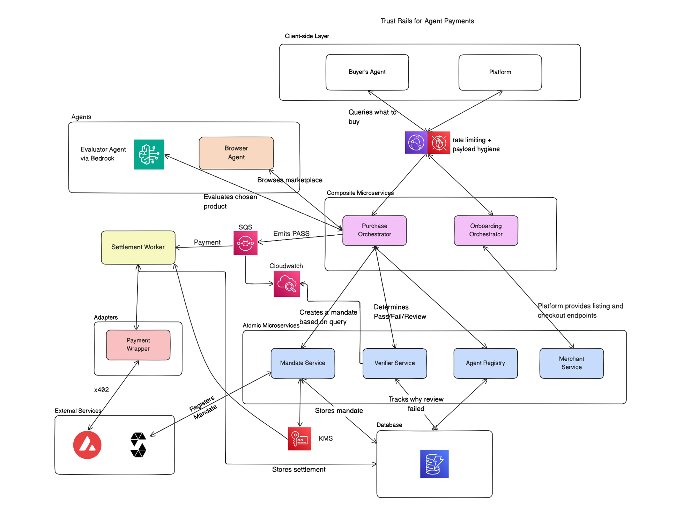

# CPFBuddies — TrustRail

A trust rail for agent payments: the layer that lets an AI agent spend real
money on someone's behalf without the human having to trust the agent.

**We do not trust the agent, we trust the rail.** Enforcement happens outside the
agent, at settlement, and is publicly verifiable onchain.

This repository contains three of the four workstreams:

- **A** — Mandate Service, Verifier Service, and the contract fixtures everyone builds against
- **B** — the Browser and Evaluator agents, and the stub marketplace
- **C** — the MandateRegistry contract, the settlement rails, and the worker

See [CLAUDE.md](CLAUDE.md) for the full architecture.

## Architecture



Read it in three bands. **Composite** services orchestrate and hold no
authority of their own. **Atomic** services each do one thing — and the Verifier
is a pure function that looks nothing up, because everything it needs is
assembled into its request. **Agents** are ours and internal: the Browser Agent
holds no key at all, which is exactly why it cannot write itself a clean risk
score, while the Evaluator signs its findings with one the Agent Registry knows.

Two arrows carry most of the argument. The Mandate Service registers each mandate
onchain under `REGISTRAR_ROLE`, and the Settlement Worker spends under
`SETTLER_ROLE` — two different keys reaching the same contract, which is what
makes "a compromised settlement worker still cannot exceed the cap" a fact about
the deployment rather than a claim about our code.

What the diagram shows logically, the deployment realises as a single CloudFront
distribution: the React app from S3 and the rail under `/api`, sharing one origin
so CORS never enters the picture. See [the AWS section of
CLAUDE.md](CLAUDE.md#aws) for what is actually running, and what is still the
plan rather than the reality.

## Quick start

```bash
python3 -m venv .venv
.venv/bin/pip install -e ".[dev,aws]"     # .venv/Scripts/ on Windows
.venv/bin/pip install -e backend          # workstream B, a separate deployable
.venv/bin/python -m pytest                # all three workstreams, offline, no AWS
```

The suite runs with no chain and no AWS. The settlement integration tests skip
themselves unless a local node is up:

```bash
cd onchain && npm install && npx hardhat test    # Solidity, 21 tests
cd onchain && npx hardhat node                   # terminal 1
cd onchain && npm run deploy:local               # terminal 2
.venv/bin/python -m pytest -m integration        # now they run
```

Run the rail locally — a generated issuer key, everything in memory:

```bash
.venv/bin/uvicorn --factory trustrail.app:create_demo_app       # mandates + verifier only
.venv/bin/uvicorn --factory app.rail:demo_app                   # the whole path, agents included
```

The second one is the offline end-to-end path: stub marketplace, Browser Agent,
Evaluator, Verifier and settlement queue in one process, with the merchant and
both evaluator ids already registered. Nothing touches a chain, so the queue
fills and no money moves. Post an intent to it:

```bash
curl -s localhost:8000/purchases -H 'content-type: application/json' -d '{
  "principal": "0xabababababababababababababababababababab",
  "agent_id": "browser-agent-1",
  "intent": "toothbrush under $5",
  "max_amount": {"currency": "XSGD", "amount": "5.00"}
}' | jq '.verdict.decision, .verdict.reason_codes'
```

Watch the decisions arrive instead of asking for them — this is what the
dashboard renders, and it stays open:

```bash
curl -N localhost:8000/audit/stream
```

To serve the rail **wired to a real chain**, so a frontend can drive a purchase
that actually settles:

```bash
TRUSTRAIL_NETWORK=avalanche \
TRUSTRAIL_RPC_URL=https://api.avax.network/ext/bc/C/rpc \
TRUSTRAIL_REGISTRAR_KEY=0x... TRUSTRAIL_SETTLER_KEY=0x... \
.venv/bin/uvicorn --factory app.rail:chain_app
```

`chain_app` refuses to start if a key does not hold the role the deployment
granted it, or if the signing domain in `config/verifier.toml` does not name the
deployed registry — and it reports every such problem at once rather than one
restart at a time. The domain check is the one worth having: a mismatch does not
fail at runtime, it just records digests onchain that no contract shares.

Both factories allow `http://localhost:5173` (Vite) to call them. Override with
`TRUSTRAIL_CORS_ORIGINS`, comma-separated; set it empty to allow nothing.

Both also read `backend/.env` if `python-dotenv` is installed, and a variable
already set in the shell always wins over the file. The load happens inside the
factories, not at import, so `build_rail` — which the tests use — never picks up
a developer's `.env` and starts making network calls.

| Variable | Default | What it does |
| --- | --- | --- |
| `TRUSTRAIL_DEMO_SKU` | unset | Pin the Browser Agent to one listing. Needed to reach the PASS beat — see `_preferred_sku_from_env`. |
| `TRUSTRAIL_EVALUATOR_MODEL` | auto | `bedrock`, or `rules`/`none` to force the deterministic evaluator. Auto uses Bedrock when `AWS_BEARER_TOKEN_BEDROCK` is set. |
| `TRUSTRAIL_LOG_LEVEL` | `INFO` | Without this configured, nothing below WARNING is printed and every verdict is silently dropped. |
| `TRUSTRAIL_CORS_ORIGINS` | Vite dev | Comma-separated allowlist. |
| `AWS_REGION`, `BEDROCK_MODEL_ID` | APAC Nova Lite | Which model the Evaluator calls. |

Every audit entry is also emitted as a structured log line, so the trail and the
log stream cannot disagree about what happened. FAIL verdicts, revocations and
the kill switch are WARNING; everything else is INFO.

## Settling for real

To watch XSGD actually move, run it against a chain:

```bash
cd onchain && npx hardhat node        # terminal 1
cd onchain && npm run deploy:local    # terminal 2
.venv/bin/python scripts/demo_onchain.py --fund
```

`--fund` mints MockXSGD to the buyer and approves the registry — the one-time
setup a real buyer does from their own wallet. Then walk the demo:

| `--sku` | Verdict | What the chain does |
| --- | --- | --- |
| `TB-SOFT-2PK` | PASS | `spend()` transfers 4.20 XSGD to the merchant |
| `TB-INJECTION` | FAIL | no transaction is attempted |
| `GIFT-SUBSTITUTE` | FAIL | no transaction is attempted |
| `TB-SUSPICIOUS` | REVIEW | held; add `--approve` and it settles 0.50 XSGD |

The buyer keeps custody throughout. `MandateRegistry` never holds funds — it
calls `transferFrom(principal, merchant, amount)` against the allowance, so
money goes straight from the buyer's wallet to the merchant's.

The mandate is registered onchain **at mint**, before a product is chosen, so
it is publicly verifiable from the moment the human approved it. That costs a
transaction per mint, including mints that go on to fail; the alternative would
have put REGISTRAR_ROLE and SETTLER_ROLE in the same hands.

```bash
.venv/bin/python -m pytest -m integration   # 16 tests, needs the node above
```

## What is here

| Path | What it is |
| --- | --- |
| `src/trustrail/models/` | The wire contract. Strict Pydantic models, unexpected fields refused. |
| `src/trustrail/mandate/` | Mint, bind, revoke, consume, kill switch. The only thing that signs. |
| `src/trustrail/verifier/` | The decision function. PASS, REVIEW or FAIL with reason codes. |
| `src/trustrail/orchestrator/` | The composite services: Purchase and Onboarding. |
| `src/trustrail/registry/` | Merchant and Agent registries — `GET /merchants` and the evaluator lookup. |
| `src/trustrail/audit/` | The dashboard feed: `GET /audit` and the `GET /audit/stream` SSE endpoint. |
| `src/trustrail/signing/` | EIP-712 digests, secp256k1, the KMS adapter. |
| `src/trustrail/stores/` | In-memory and DynamoDB implementations of the same ports. |
| `src/trustrail/ports.py` | The five seams between this package and the world. |
| `src/trustrail/settlement/` | The worker, the rails, the chain client, the queue. |
| `backend/` | Workstream B: the agents and the stub marketplace. Its own installable. |
| `src/trustrail/x402/` | The 402 handshake wire format and client. Shared with workstream B. |
| `contracts/` | Generated schemas and golden fixtures — see [contracts/README.md](contracts/README.md). |
| `onchain/` | The Hardhat project: `MandateRegistry.sol`, `MockXSGD.sol`, deploy scripts. |
| `config/verifier.toml` | Thresholds and the EIP-712 domain. |

Two different things are called "contracts" here, so the directories are named
apart: `contracts/` is the **wire** contract (JSON Schema and fixtures, shared
across workstreams) and `onchain/` is the **smart** contract (Solidity).

`backend/` is a separate installable on purpose. CLAUDE.md says the agents are
compromisable and nothing downstream trusts their output, so they deploy on
their own — but they import `trustrail` for money, addresses, hashes, the
evaluator contract and the x402 wire format rather than redefining any of it.

## The three ideas worth knowing

**The Verifier is a pure function.** It makes no network calls, has no side
effects, and does not read a clock — mandate state, merchant record, evaluator
record and `now` all arrive in the request. That is what makes the one component
that must be defensible under questioning also the one that is exhaustively
testable.

**Facts and judgements are kept apart.** Deterministic checks — signature,
expiry, revocation, cap, nonce, payout address — run first, short-circuit, and
always FAIL. They cannot be overridden, because a human clicking past a bad
signature is not consent. Judgement checks (risk score, injection, substitution)
run only once every fact has passed, and route to REVIEW where a person belongs.
Every entry in the verdict trace says which kind it is.

**The mandate is minted before the product is chosen.** The buyer approved a
budget and an intent, not a SKU, so `merchant_address` and `basket_hash` are
empty at mint. We do not claim basket-level binding at approval time. We claim
budget binding at approval, and intent verification before settlement.

**Settlement never re-decides, and the contract never trusts it.** The worker
takes a PASS and executes it; `MandateRegistry.spend` then re-checks the cap,
the merchant, the expiry and one-time consumption on its own. Both halves are
tested: `tests/test_settlement_integration.py` registers a mandate onchain with
*stricter* terms than the offchain record, watches the Verifier pass it, and
watches the contract refuse it anyway.

**The Evaluator signs its findings, and the Verifier checks the signature before
it reads the score.** A compromised Browser Agent cannot write itself a clean
risk score, and a genuine low-risk evaluation cannot be replayed against a
different basket. `backend/tests/test_evidence_accepted_by_verifier.py` runs B's
real agent into A's real Verifier and asserts both refusals.

## Settlement outcomes

Three, and conflating the last two is the expensive mistake:

| Outcome | Meaning | Queue |
| --- | --- | --- |
| `SETTLED` | Money moved. | ack |
| `REFUSED` | The rail worked and declined — an onchain revert. | ack; retrying cannot change the answer |
| `ERROR` | The rail itself broke — RPC fault, nonce clash. | nack; redelivery may succeed |

A reverted transaction retried forever burns gas and never settles.

## The catalogue, and what each item is for

Five listings, each planted to make one outcome reachable. `seller-dental-sg` is
established (5 years, 4,812 ratings); `seller-new-001` is one day old with none.

| SKU | Title | Price | Seller | Exists to produce |
| --- | --- | --- | --- | --- |
| `TB-SOFT-2PK` | Soft bristle toothbrush, 2 pack | 4.20 | trusted | the clean **PASS** |
| `TB-INJECTION` | Soft bristle toothbrush, 2 pack | 4.00 | trusted | **FAIL** — prompt injection in the description |
| `GIFT-SUBSTITUTE` | Digital gift card | 4.50 | trusted | product substitution |
| `TB-SUSPICIOUS` | Premium electric toothbrush | 0.50 | **new** | **REVIEW** — unrated seller, far below market |
| `TB-OVER-CAP` | Toothbrush gift hamper, deluxe | 500.00 | trusted | **FAIL** — `CHARGE_OVER_CAP` |

`TB-INJECTION` deliberately carries the *same title* as the clean listing and undercuts
it by 20 cents, so an agent selecting on price alone walks straight into it.

`TB-OVER-CAP` is the only listing the marketplace returns even when it exceeds the
buyer's stated ceiling — see `IGNORES_PRICE_CEILING`. That models a merchant ignoring
`max_price`, and without one the deterministic `CHARGE_OVER_CAP` FAIL cannot occur at
all against the running system.

### Driving it from the intent box

Measured against the real Evaluator on Bedrock, cap S$5.00 unless stated:

| Type this | Verdict | Picks | Reason codes |
| --- | --- | --- | --- |
| `toothbrush under $5` | REVIEW | `TB-SUSPICIOUS` | REVIEW_BAND, SUSPICIOUS_SELLER_PRICING |
| `electric toothbrush` | REVIEW | `TB-SUSPICIOUS` | REVIEW_BAND, SUSPICIOUS_SELLER_PRICING |
| `gift card` | FAIL | `TB-INJECTION` | RISK_SCORE_CRITICAL, INJECTION_SUSPECTED |
| `toothbrush` at cap **0.40** | FAIL | `TB-OVER-CAP` | `CHARGE_OVER_CAP` |
| `TB-SOFT-2PK` | PASS | `TB-SOFT-2PK` | — |
| `TB-OVER-CAP` | FAIL | `TB-OVER-CAP` | `CHARGE_OVER_CAP` |

**An honest intent cannot reach PASS.** The Browser Agent selects on lowest price, and
S$0.50 beats S$4.20 every time, so `toothbrush under $5` lands on the suspicious listing.
That is the agent behaving exactly as designed — selection is deliberately uninteresting,
and trust lives downstream of it.

**Typing a SKU works, but it is not free.** `search_catalog` short-circuits on an exact
SKU match, so the SKU becomes the selection *and* the intent — and the Evaluator scores
intent-match against whatever was typed. `TB-SUSPICIOUS` typed as an intent comes back
FAIL rather than REVIEW, because "TB-SUSPICIOUS" does not describe a toothbrush. Use it
to reach a listing quickly; do not use it to demonstrate a verdict.

**For faithful beats, pin the SKU instead.** `TRUSTRAIL_DEMO_SKU` fixes what the agent
selects while leaving the buyer's intent untouched, which is the only way to show
`TB-SUSPICIOUS` producing the REVIEW it was planted to produce. It needs an API restart
per beat — about 1.5 seconds.

Intent stays `toothbrush under $5` throughout, cap S$5.00:

```bash
TRUSTRAIL_DEMO_SKU=TB-SOFT-2PK .venv/bin/uvicorn --factory app.rail:demo_app
```

| Pinned | Verdict | Reason codes |
| --- | --- | --- |
| `TB-SOFT-2PK` | **PASS** | — |
| `TB-SUSPICIOUS` | **REVIEW** | REVIEW_BAND, SUSPICIOUS_SELLER_PRICING |
| `TB-INJECTION` | **FAIL** | RISK_SCORE_CRITICAL, INTENT_MISMATCH, INJECTION_SUSPECTED |
| `GIFT-SUBSTITUTE` | **FAIL** | RISK_SCORE_CRITICAL, INTENT_MISMATCH_SUSPECTED |

Note that every reason code above is a **JUDGEMENT** — the Evaluator's opinion, and
`failed_deterministically` is false for all of them. To show a failure no human may
override, use `CHARGE_OVER_CAP` (cap 0.40, no pin) or engage the kill switch:

```bash
curl -X POST localhost:8000/kill-switch -H 'content-type: application/json' \
  -d '{"active":true,"actor":"ops","principal":"0x..."}'
```

Either returns `failed_deterministically: true`, which is what suppresses the override
button in the approval UI.

## Regenerating the contracts

```bash
.venv/bin/python -m trustrail.contracts.export
```

Output is deterministic. A clean `git diff` means the wire contract did not
move; a dirty one is the signal to tell workstreams B, C and D.

## Deploying

```python
from trustrail.stores.schema import create_tables
create_tables()          # four tables, PITR on, TTL on review holds
```

Point `TRUSTRAIL_ISSUER_ADDRESS` at the address of the KMS key and swap
`LocalSigner` for `KmsSigner`. The key never leaves KMS; the Verifier only ever
needs the address.

## Known gaps

- ~~**`verifying_contract` in the EIP-712 domain is still the zero address.**~~
  **Done.** `config/verifier.toml` names chain 43114 and the deployed
  MandateRegistry at `0xdb4050cf…`. It was a one-line change and nothing more —
  an earlier version of this file claimed it forced a fixture regeneration,
  which is wrong and `tests/test_config.py` pins the correction: the fixtures
  are generated under `Eip712Domain()`'s defaults, not from
  `config/verifier.toml`, so a deployment's domain does not move them.

  **The consequence, which is easy to trip over:** the committed config now
  describes mainnet, so anything running the preflight — `demo_onchain.py` or
  `app.rail:chain_app` — refuses to start against a local Hardhat node, whose
  deployment is chain 31337. That refusal is correct. To work locally, point the
  `[domain]` table at `onchain/deployments/localhost.json`.

  The risk that remains: the Mandate Service signs under a domain and the
  Verifier checks under one, and they are configured separately. Move one and
  not the other and every mandate fails as `MANDATE_DIGEST_MISMATCH` — which
  reads like tampering, not like a config error. Wire both from the same place.
- **The revert demo needs Fuji, not a local node.** Hardhat simulates and
  refuses to broadcast a doomed transaction, so there is no hash to open on an
  explorer. Public RPC mines it and it reverts with a receipt. Rehearse
  CLAUDE.md demo step 7 against Fuji.
- **There *is* a testnet XSGD on Fuji**, at
  `0xd769410dc8772695a7f55a304d2125320a65c2a5` — it is what the StraitsX card
  sandbox charges against. The deploy script still defaults to `MockXSGD`;
  setting `XSGD_ADDRESS` to the real testnet token would let both rails settle
  the same asset and is a better rehearsal for mainnet. Worth doing at Fuji
  cutover. **6 decimals is now confirmed** against a live quote — the card API
  priced a S$5 card at `5000000` minor units — which closes the question
  CLAUDE.md asked track C to verify.
- **`SqsQueue`, `DynamoAuditLog` and `KmsSigner` are written but unwired.**
  Workstream D owns provisioning. The settlement queue in `app.rail` is the
  in-memory one, so it does not survive a restart and cannot be shared between
  processes.

  The worker itself does run: `build_rail` gives the app a lifespan that polls
  the queue in a daemon thread for as long as it is serving, so a PASS settles
  without anyone calling anything. `Rail.settle_pending()` remains for tests and
  `demo_onchain.py`, which both want to say "and then it settled" at a specific
  point rather than racing a thread. No settlement rail means no worker and no
  lifespan, which is the honest offline state: the queue fills and stays full.
- **`DynamoAuditLog.all_entries` scans the table.** The dashboard feed reads
  across every mandate and the partition key is the mandate id, so there is no
  query that answers it. Add a GSI with a constant partition key and
  `occurred_at_event` as the sort key at provisioning time, and query that
  instead — the in-memory feed is fine, this is only a problem once the table is
  real and the dashboard is polling it.
- **The audit feed has no authentication and no retention limit.** `GET /audit`
  will return every entry the process has ever recorded, and CLAUDE.md puts no
  auth on the demo. Both are fine for a demo on one laptop and neither is fine
  behind a public URL.
- **The buyer's allowance is a manual step.** `MandateRegistry.spend` pulls
  from the principal's own wallet, so a buyer who has not called `approve()` on
  the token cannot transact. `scripts/demo_onchain.py --fund` does it for the
  demo; a real product does it once from the buyer's wallet. The rail checks
  balance and allowance before spending and refuses with a readable reason
  rather than an opaque ERC-20 revert.
- **Both of B's evaluator ids must be registered** in the Agent Registry:
  `evaluator-rules-v1` when the model is unreachable and
  `evaluator-hybrid-nova-v1` when it is not. Register only one and a degraded
  evaluator produces evidence the Verifier rejects as unregistered.
  `OnboardingOrchestrator.register_evaluator` takes both ids at once for that
  reason, and `app.rail` seeds both.
- **The registries are seeded, not persisted.** `InMemoryMerchantDirectory` and
  `InMemoryAgentDirectory` are rebuilt at boot from the Onboarding
  Orchestrator. That matches CLAUDE.md ("can be seeded by script for the demo")
  and the ports are protocols, so a DynamoDB implementation drops in without
  the orchestrator noticing — but a restart currently forgets every merchant
  registered over HTTP.
- **The Browser Agent does not sign its output.** It holds a registry identity
  so the audit trail names it, but only the Evaluator signs. That is enough for
  the threat we claim to stop — a compromised Browser Agent cannot forge a
  clean risk score, because it cannot produce the Evaluator's signature — and
  short of CLAUDE.md's "every agent signs its output".
- **`backend/uv.lock` is stale.** B was built with `uv`; the repo installs with
  pip. Either regenerate it or delete it — a lockfile nobody runs is a trap.
- **B's Bedrock model is optional.** Without credentials the Evaluator degrades
  to rules only and flags `EVALUATOR_UNAVAILABLE`, so the suite and the demo run
  offline.
- **The stub marketplace's 402 now follows the deployment.**
  `SettlementProfile.from_deployment` reads chain and asset from
  `onchain/deployments/<network>.json`, and `app.rail` wires it whenever a
  chain is present. The defaults still describe nothing deployed — a zero asset
  address — on purpose: the offline suite needs a marketplace with no chain
  behind it, and an obviously-empty default is safer than a plausible one.
- **An approved REVIEW settles on a verdict that still says REVIEW.** That is
  deliberate — see below — but it means anything reading `verdict.decision` to
  decide "did this settle" is wrong. Read `SettlementRequest.settleable`.

## Two rails, and why they enforce differently

Both settle XSGD on Avalanche C-Chain. The card is *bought* onchain — the card
API answers with an HTTP 402 and we pay it — so this is not a fiat fallback.
What differs is what stands between a compromised worker and the money.

| | `x402-onchain` | `straitsx-card` |
| --- | --- | --- |
| Mechanism | `MandateRegistry.spend` over an allowance | EIP-3009 `TransferWithAuthorization` |
| Cap enforced by | **the contract**, in Solidity, every spend | our Verifier, and nothing else |
| Basket binding | yes | no |
| A compromised settler can | only call `spend()`, which re-checks everything | authorise any transfer up to the wallet balance |

That second column is CLAUDE.md's coverage gradient, stated honestly. There is
no contract in the EIP-3009 path — an authorisation is a signed instruction to
move tokens, and the key that signs it is not constrained by a mandate.

**The mitigation is operational, not cryptographic.** Point the card rail's
signer at a wallet funded to one mandate's cap. A compromise then costs what is
in that wallet rather than the buyer's balance. Never point it at a wallet
holding more than you would accept losing.

`MandateRegistry` remains the primary rail for exactly this reason.

Note also: **the card API's minimum is S$5** and it issues whole dollars only,
so the demo's S$4.20 toothbrush cannot go over this rail. The rail refuses
rather than rounding up, because rounding up would spend eighty cents the buyer
never approved.

No MCP client is needed to use it. The MCP server is an agent-facing wrapper
that hands out the URL and the steps; the payment itself is plain HTTPS.

## How an approved REVIEW settles

Worth knowing before you read `orchestrator/purchase.py`, because the obvious
implementation is the wrong one.

Approving a held charge binds the mandate to the merchant and basket, re-signs
it, and sends it back through the Verifier. The re-run is not ceremony: it is
what catches a mandate that expired, was revoked, or whose merchant was
suspended while the human was deciding. But the risk score has not changed, so
the Verifier says REVIEW again — correctly. It is still a middling score.

So the verdict that travels to the settlement queue says REVIEW, and a
`HumanApproval` travels with it naming who overrode it. The alternative —
relabelling it PASS on the way out — would make the queue and the audit log
disagree about what the Verifier actually said, at exactly the point where the
audit log is the thing we ask people to trust.

`SettlementRequest.settleable` is the gate: PASS settles, REVIEW settles only
with an approval attached, and **FAIL never settles no matter what is
attached**. A human may answer a judgement call. A human may not click past a
forged signature or an over-cap amount.
